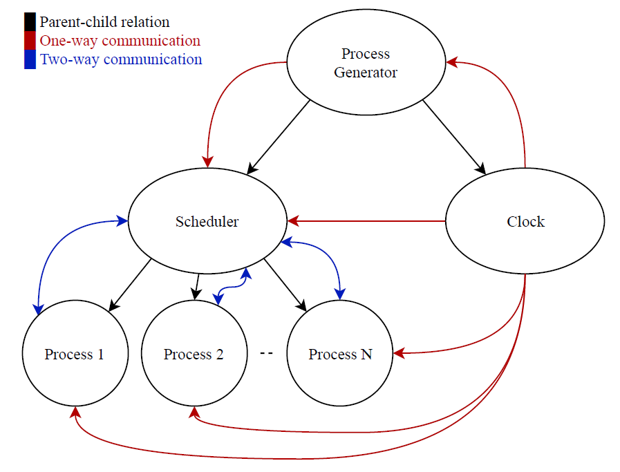
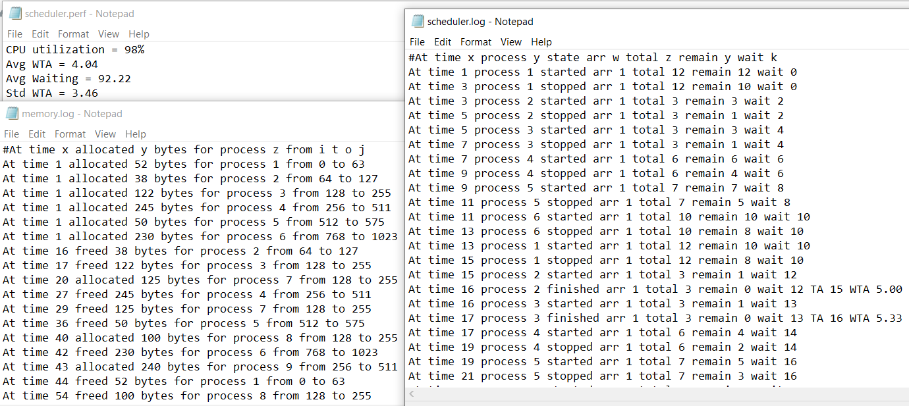
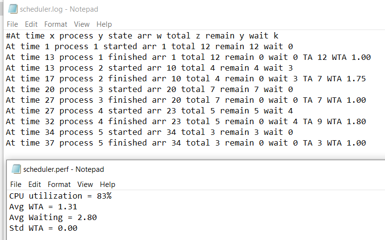

<div align="center">

</div>

<div align="center">

[](https://github.com/ZeyadTarekk/Mini-OS/contributors)
[](https://github.com/ZeyadTarekk/Mini-OS/issues)
[](https://github.com/ZeyadTarekk/Mini-OS/blob/master/LICENSE)
[](https://github.com/ZeyadTarekk/Mini-OS/network)
[](https://github.com/ZeyadTarekk/Mini-OS/stargazers)
[](https://img.shields.io/github/languages/count/ZeyadTarekk/Mini-OS)

</div>

## 📝 Table of Contents

- [About](#about)
- [System Description](#sys)
- [Get started](#get-started)
  - [Prerequisite](#req)
  - [Installation](#Install)
  - [Running](#running)
- [Technology](#tech)
- [Demo Outputs](#outputs)
- [Contributors](#Contributors)
- [License](#license)

## 📙 About <a name = "about"></a>

- A CPU scheduler determines an order for the execution of its scheduled processes; it decides which process will run according to a certain data structure that keeps track of the processes in the system and their status.
- A process, upon creation, has one of the three states: Running, Ready, Blocked (doing I/O, using other resources than CPU or waiting on unavailable resource).

## 📃 System Description <a name = "sys"></a>

- Consider a Computer with 1-CPU and fixed size memory (1024 ==> can be changed). Our scheduler implemented the complementary components as sketched in the following diagrams.

📌 NOTE:

> We are supporting the following Scheduling algorithms:

1. HPF (Highest Priority First)
2. STRN (Shortest Time Remaining Next)
3. RR (Round Robin)
   > For memory we are using the buddy memory allocation system.

<div align='center'></div>

## 🏁 Getting Started <a name = "get-started"></a>

> This is an list of needed instructions to set up your project locally, to get a local copy up and running follow these
> instructuins.

### Prerequisite <a name = "req"></a>

1. Any unix based system
2. GCC compiler installed

### Installation <a name = "Install"></a>

1. **_Clone the repository_**

```sh
$ git clone https://github.com/ZeyadTarekk/Mini-OS.git
```

2. **_Navigate to Phase2 Folder_**

```sh
$ cd Phase2
```

### Running <a name = "running"></a>

**_Running program_**

1. **_First remove the old files_**

```sh
$ make clean
```

2. **_Build all the needed files_**

```sh
$ make build
```

3. **_Run the test generator to generate a files of random procceses_**

```sh
$ ./test_generator.out
```

4. **_Now run the scheduler_**

```sh
$ make run
```

## 💻 Built Using <a name = "tech"></a>

- **C**

## Demo Outputs <a name = "outputs"></a>

<div align="center">
<h3 align='left'>HPF</h3>
   

<h3 align='left'>RR</h3>
</a>
<h3 align='left'>SRTN</h3>
</a>
</div>

## Contributors <a name = "Contributors"></a>

<table>
  <tr>
    <td align="center">
    <a href="https://github.com/ZeyadTarekk" target="_black">
    
    <br />
    <sub><b>Zeyad Tarek</b></sub></a>
    </td>
    <td align="center">
    <a href="https://github.com/Abd-ELrahmanHamza" target="_black">
    
    <br />
    <sub><b>Abdelrahman Mohamed</b></sub></a>
    </td>
    <td align="center">
    <a href="https://github.com/BeshoyMorad" target="_black">
    
    <br />
    <sub><b>Beshoy Morad</b></sub></a>
    </td>
    <td align="center">
    <a href="https://github.com/ZiadSheriif" target="_black">
    
    <br />
    <sub><b>Ziad Sherif</b></sub></a>
    </td>
    
    
  </tr>
 </table>

## License <a name = "license"></a>

> This software is licensed under MIT License, See [License](https://github.com/ZeyadTarekk/Mini-OS/blob/main/LICENSE) for more information ©ZeyadTarekk.
